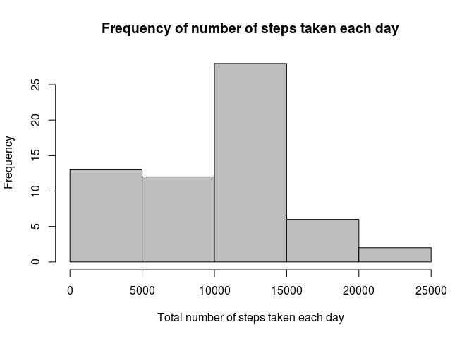
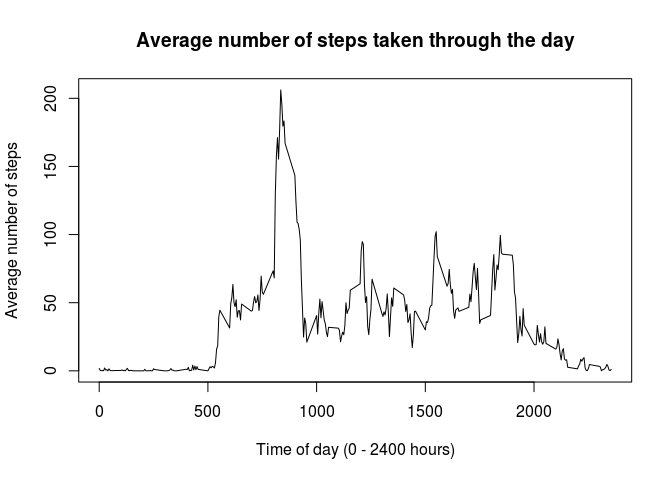
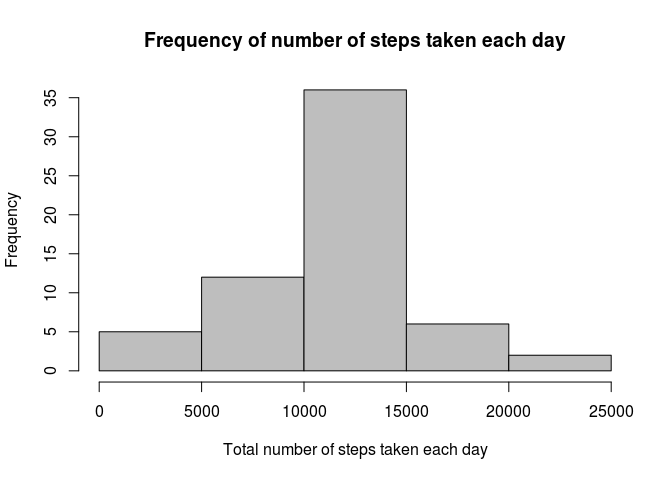
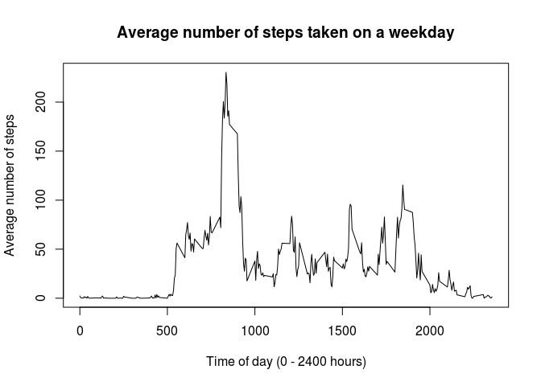
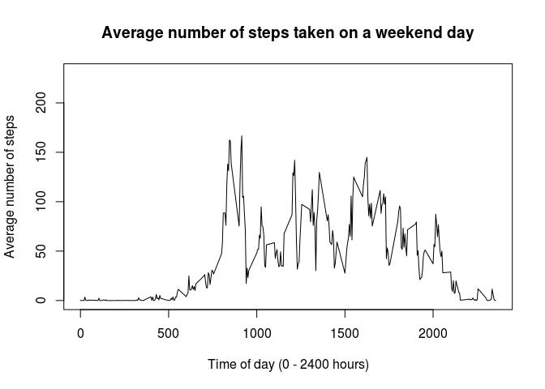

# Reproducible Research: Peer Assessment 1


*June 2015*

*This report was written for Johns Hopkins University Coursera "Reproducible Research" course*

*The headers below correspond to the headers in the assignment instructions.  Quotes are from the assignment instructions.*


## Introduction

"It is now possible to collect a large amount of data about personal movement using activity monitoring devices such as a Fitbit, Nike Fuelband, or Jawbone Up. These type of devices are part of the “quantified self” movement – a group of enthusiasts who take measurements about themselves regularly to improve their health, to find patterns in their behavior, or because they are tech geeks...."

This report examines "data from a personal activity monitoring device. This device collects data at 5 minute intervals through out the day. The data consists of two months of data from an anonymous individual collected during the months of October and November, 2012 and include the number of steps taken in 5 minute intervals each day."


## Data

"The variables included in this dataset are:
--steps: Number of steps taking in a 5-minute interval (missing values are coded as NA)
--date: The date on which the measurement was taken in YYYY-MM-DD format
--interval: Identifier for the 5-minute interval in which measurement was taken
...there are a total of 17,568 observations in this dataset."


## Loading and preprocessing the data

First, we need to read in our data.


```r
data = read.csv("activity.csv", header = TRUE)
```


## What is mean total number of steps taken per day?

Let's look at the distribution of how many total steps were taken each day during the two months for which we have data.


```r
stepsbydate = tapply(data$steps, data$date, sum, na.rm = TRUE)
hist(stepsbydate, col = "gray", xlab = "Total number of steps taken each day", 
     main = "Frequency of number of steps taken each day")
```

 

As you can see, the participant most commonly walked between 10,000 and 15,000 steps per day.  The participant walked less than that range on many days, but walked more than that on relatively few days.

On average (i.e, the arithmetic mean), the participant walked 9354.2 steps per day.  The median number of steps that the participant walked per day was 10395.

*(Inline R code is used to calculate the mean and the median above, but it does not display -- and would interrupt the sentence if it did -- so it is reproduced below):*


```r
format(mean(stepsbydate), digits = 5)
```

```
## [1] "9354.2"
```

```r
median(stepsbydate)
```

```
## [1] 10395
```


## What is the average daily activity pattern?

To understand the participant's daily activity pattern, we can look at the average number of steps that the participant took during the course of the day.


```r
meansbyinterval = tapply(data$steps, data$interval, mean, na.rm = TRUE)
plot(meansbyinterval ~ names(meansbyinterval), type = "l", data = data, 
     ylab = "Average number of steps", xlab = "Time of day (0 - 2400 hours)",
     main = "Average number of steps taken through the day")
```

 

The participant on average walked very little from midnight (0 hours) to about 5:00 AM (500 hours).  Presumably, the participant was usually sleeping during that interval.  Shortly thereafter, the participant awoke and activity increased into a range of about 30 to 100 steps, where it remained on average through most of the remaining day.  The primary exception was when the step activity spiked and reached a maximum of about 200 steps at ``835`` hours.  The activity begins tapering off shortly before 8:00 PM (2000 hours).

*(Inline code is below.)*


```r
names(meansbyinterval)[which.max(meansbyinterval)[[1]]]
```

```
## [1] "835"
```


## Imputing missing values

As mentioned in the data description above (under the heading "Data"), there are 17,568 observations in this data set.  Out of these, ``2304`` observations were missing (i.e., coded as 'NA' in the data set).

*(Inline code is below.)*


```r
sum(is.na(data$steps))
```

```
## [1] 2304
```

We can impute the missing data by substituting the average number of steps for the corresponding 5-minute time interval on all the other days with data available.  We can again look at the average number of steps that the participant took during the course of the day, but we'll use the imputed data this time.


```r
imputeddata = data
naindices = which(is.na(imputeddata$steps))  # row indices with missing values
meansbyintervalexpand = rep(as.vector(meansbyinterval), 
                            times = dim(imputeddata)[1] / length(meansbyinterval))
imputeddata$steps[naindices] = meansbyintervalexpand[naindices]
stepsbydate2 = tapply(imputeddata$steps, imputeddata$date, sum, na.rm = TRUE)
hist(stepsbydate2, col = "gray", xlab = "Total number of steps taken each day", 
     main = "Frequency of number of steps taken each day")
```

 

And with the imputed data, we can again look at the mean and median number of steps taken by the participant.

Mean

```r
mean(stepsbydate2)
```

```
## [1] 10766.19
```

Median

```r
median(stepsbydate2)
```

```
## [1] 10766.19
```

When we compare the histograms of the original data (with the missing data) and the imputed data, we can see that imputing the data has shifted many of the days with a low number of steps (0 - 5000 steps) into a more medium range of steps (10,000 - 15,000 steps), so that the peak of the histogram, which is in the medium range of steps, is much higher.  We might say that imputing the date had a "centralizing" effect on the data distribution, by pulling more of the data points (i.e., the number of steps per day) to the center of the distribution.

This "centralizing" effect is also evident when we look at the mean and median number of steps taken by the participant.  In the original data, the mean 9354.2 was less than the median 10395, indicating a negative skew to the data distribution.  With the imputed data, the mean 10766.2 and the median 10766.2 are equal, indicating that the distribution is not skewed overall.

Imputing the data also increased the overall number of steps.  As mentioned above, many of the days with a low number of steps (0 - 5000 steps) shifted to a higher number of steps in the middle part of the distribution (10,000 - 15,000 steps).  We can also show this by calculating the total number of steps for the original (570608) and the imputed data (656738); the latter is higher.

*(Inline code is below.)*

Mean number of steps per day for original data:

```r
format(mean(stepsbydate), digits = 5)
```

```
## [1] "9354.2"
```

Median number of steps per day for original data:

```r
format(median(stepsbydate), digits = 6)
```

```
## [1] "10395"
```

Mean number of steps per day for imputed data:

```r
format(mean(stepsbydate2), digits = 6)
```

```
## [1] "10766.2"
```

Median number of steps per day for imputed data:

```r
format(median(stepsbydate2), digits = 6)
```

```
## [1] "10766.2"
```

Total number of steps for original data:

```r
format(sum(stepsbydate), digits = 6)
```

```
## [1] "570608"
```

Total number of steps for imputed data:

```r
format(sum(stepsbydate2), digits = 6)
```

```
## [1] "656738"
```


## Are there differences in activity patterns between weekdays and weekends?

Let's take a look at how the participant's activity patterns through the day may have differed between weekdays and weekends.


```r
days = weekdays(as.POSIXct(imputeddata$date))
imputeddata[ , dim(imputeddata)[2] + 1] = ifelse(days == "Saturday" | days == "Sunday", 
                                             "weekend", "weekday")
colnames(imputeddata)[dim(imputeddata)[2]] = "weekdayorend"
meansbyintervalweekday = tapply(imputeddata[imputeddata$weekdayorend == "weekday", ]$steps, 
                                imputeddata[imputeddata$weekdayorend == "weekday", ]$interval, 
                                mean, na.rm = TRUE)
meansbyintervalweekend = tapply(imputeddata[imputeddata$weekdayorend == "weekend", ]$steps, 
                                imputeddata[imputeddata$weekdayorend == "weekend", ]$interval, 
                                mean, na.rm = TRUE)
plot(meansbyintervalweekday ~ imputeddata$interval[1:length(meansbyintervalweekday)], 
     type = "l", ylim = c(0, max(append(meansbyintervalweekday, meansbyintervalweekend))),
     ylab = "Average number of steps", 
     xlab = "Time of day (0 - 2400 hours)",
     main = "Average number of steps taken on a weekday")
```

 

```r
plot(meansbyintervalweekend ~ imputeddata$interval[1:length(meansbyintervalweekday)], 
     type = "l", ylim = c(0, max(append(meansbyintervalweekday, meansbyintervalweekend))),
     ylab = "Average number of steps", 
     xlab = "Time of day (0 - 2400 hours)",
     main = "Average number of steps taken on a weekend day")
```

 

When we compare the graphs for the participant's activity patterns on the weekdays (top) and the weekend (bottom), we can note several differences.  On weekdays, the participant's activity increases sharply shortly after 500 hours.  On the weekends, the participant's activity rises more gradually starting shortly after 500 hours.  The activity spikes to its highest point shortly before 1000 hours on both graphs, but the spike is higher on the weekdays than on the weekends.  During the remainder of the day, the weekend activity tends to be higher than activity on weekdays; this might be the result of the participant spending much of the weekdays at a relatively sedentary job.  The only remaining time of day when the participant's weekday activity appears to be higher than the corresponding weekend activity is at a modest spike shortly before 2000 hours, which might be part of the participant's commute home.  The participant's weekday activity tapers off earlier -- before 2000 hours -- than on the weekend, where the participant is still showing activity until well after 2000 hours.

